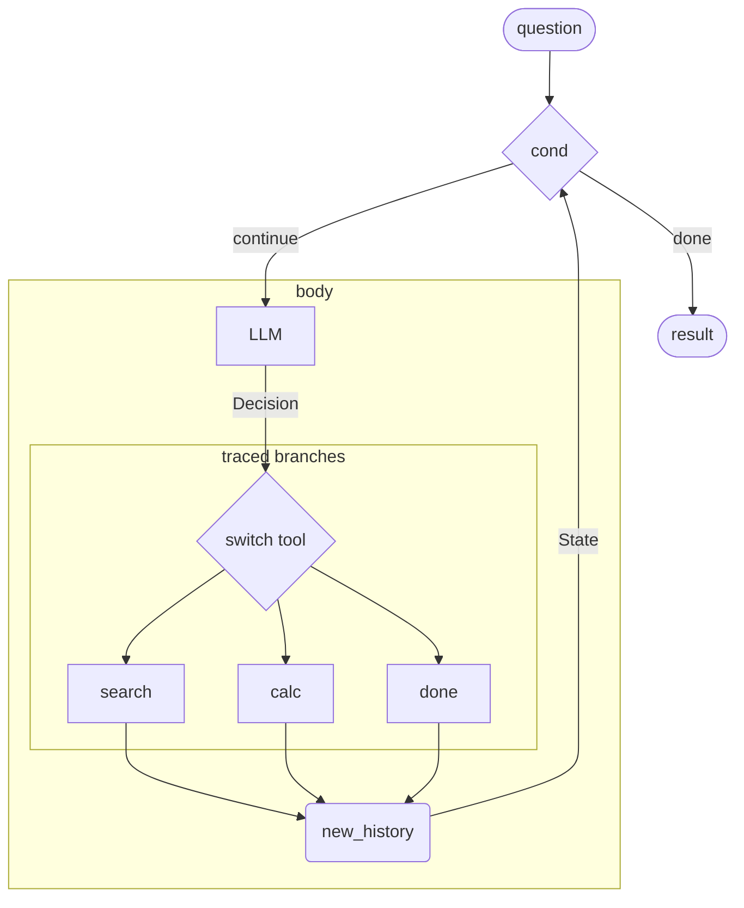

<div align="center">

# `autoform`

**Trace once. Transform freely.**

Composable function transformations for LM programs.

*Think [JAX](https://github.com/jax-ml/jax), but for LM programs.*

[](https://www.python.org/downloads/)
[](https://github.com/ASEM000/autoform/actions/workflows/ci.yml)
[](https://codecov.io/gh/ASEM000/autoform)

[Quickstart](#quickstart) - [Transforms](#transforms) - [Concurrency](#concurrency) - [Debugging](#debugging) - [Agent](#agent) - [Docs](https://autoform.readthedocs.io)

</div>

```bash
pip install git+https://github.com/ASEM000/autoform.git
```

## Quickstart
```python
import autoform as af

def explain(topic: str) -> str:
    prompt = af.format("Explain {} in one paragraph.", topic)
    msg = dict(role="user", content=prompt)
    return af.lm_call([msg], model="gpt-5.2")

ir = af.trace(explain)("...")  # capture structure, no execution
```

Now transform it:
```python
# execute
output = ir.call("quantum entanglement")

# batch: n inputs
outputs = af.batch(ir).call(["DNA", "gravity", "recursion"])

# pushforward: propagate input perturbations forward
output, tangent = af.pushforward(ir).call(("quantum entanglement", "add more examples"))

# pullback: propagate output feedback backward
output, grad = af.pullback(ir).call(("quantum entanglement", "too technical"))

# compose: batched differentiation
topics = ["DNA", "gravity", "recursion"]
critiques = ["too technical", "too brief", "too abstract"]
outputs, hints = af.batch(af.pullback(ir)).call((topics, critiques))
```

The last line is the point: `batch(pullback(ir))`, transformations compose.

## Transforms

| Transform | What it does |
|-----------|--------------|
| `batch` | Vectorize over inputs |
| `pushforward` | Forward-mode AD |
| `pullback` | Reverse-mode AD |
| `sched` | Auto-concurrent execution |

## Concurrency

`sched` finds independent LM calls. `acall` runs them concurrently.
```python
scheduled = af.sched(ir)
result = await scheduled.acall("input") # acall for async
```

## Debugging

Checkpoint intermediate values. Substitute on re-execution.
```python
def pipeline(x: str) -> str:
    msg1 = dict(role="user", content=x)
    step1 = af.lm_call([msg1], model="gpt-5.2")
    step1 = af.checkpoint(step1, key="step1", collection="debug")
    
    msg2 = dict(role="user", content=step1)
    step2 = af.lm_call([msg2], model="gpt-5.2")
    return step2

ir = af.trace(pipeline)("...")

# capture
with af.collect(collection="debug") as captured:
    result = ir.call("input")

# substitute step1 value
with af.inject(collection="debug", values=dict(step1=["modified"])):
    result = ir.call("input")
```

## Agent

Trace a tool-use agent once, then differentiate, batch, or schedule it with no code changes. Because the agent is a pure traced function, `pullback` propagates natural-language feedback backward through every LLM call, and `batch` vectorizes over inputs. Compose them: `batch(pullback(ir))` gives batched prompt optimization of the full agent graph.



```python
from typing import Literal
import autoform as af

# Struct: a tree node; each field becomes an IR leaf during tracing.
class Decision(af.Struct):
    tool: Literal["search", "calc", "done"]
    args: str
    answer: str
    status: Literal["continue", "done"]

class State(af.Struct):
    history: str
    result: str
    status: Literal["continue", "done"]

# each tool branch is traced independently; switch dispatches at runtime.
tool_branches = dict(
    search=af.trace(search)("...", "..."),  # (args, history) -> new_history
    calc=af.trace(calc)("...", "..."),
    done=af.trace(done)("...", "..."),
)

def cond(state: State):
    return af.match(state.status, "continue")

def body(state: State):
    messages = [
        dict(role="system", content="You are a tool-use agent."),
        dict(role="user", content=state.history),
    ]
    d = af.struct_lm_call(messages, model="gpt-5.2", struct=Decision)
    new_history = af.switch(d.tool, tool_branches, d.args, state.history)
    return State(history=new_history, result=d.answer, status=d.status)

cond_ir = af.trace(cond)(State(history="...", result="", status="..."))
body_ir = af.trace(body)(State(history="...", result="", status="..."))

def agent(question: str):
    init = State(history=question, result="", status="continue")
    return af.while_loop(cond_ir, body_ir, init, max_iters=5).result

agent_ir = af.trace(agent)("...")

# pullback: propagate text feedback backward through every LLM call
# batch: vectorize over multiple questions
# compose them: batched prompt optimization of the full agent
af.batch(af.pullback(agent_ir))
```

---

> ⚠️ **Early development**: API may change.