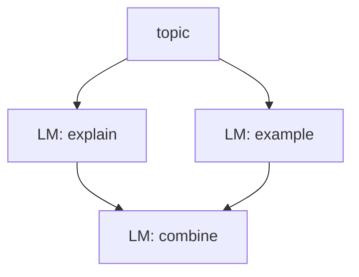
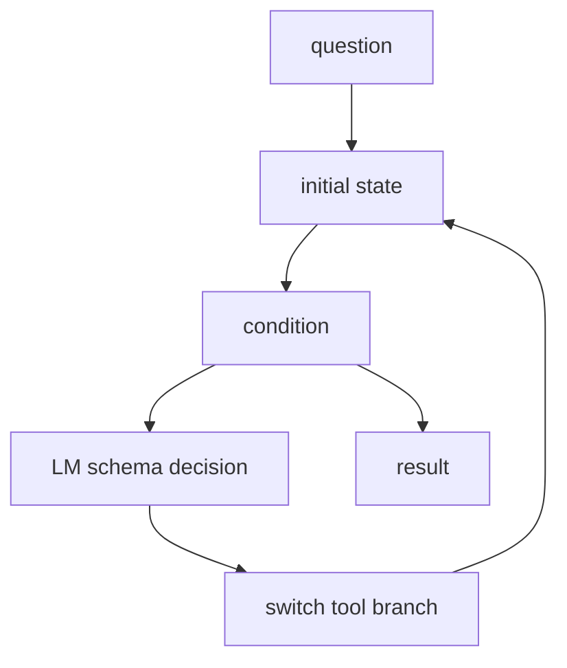

<div align="center">

# `autoform`

**Trace once. Transform freely.**

Composable function transformations for LM programs.

*JAX-like, but for LM programs: trace a Python function into an IR, then apply
program transforms around it.*

[](https://www.python.org/downloads/)
[](https://github.com/ASEM000/autoform/actions/workflows/ci.yml)
[](https://codecov.io/gh/ASEM000/autoform)

[Quickstart](#quickstart) - [Composition](#composition) - [Concurrency](#concurrency) - [Reference](#reference) - [Documentation](https://autoform.readthedocs.io)

</div>

```bash
pip install git+https://github.com/ASEM000/autoform.git
```

Set provider credentials for the LM client you use. For OpenAI through LiteLLM:

```bash
export OPENAI_API_KEY=...
```

## Why

An LM program written as ordinary Python tends to harden around the first way
you run it:

- evaluate it on 100 inputs, and you write a batched loop;
- send feedback through every LM call, and you rewrite the pipeline again;
- run independent calls concurrently, and you introduce `async def`;
- inspect a bad intermediate, and you split the function apart.

`autoform` factors those requirements differently:

- write the function once;
- trace it into an IR with `af.trace(func)(*example_args)`;
- transform the IR with `batch`, `pullback`, `pushforward`, `sched`, or `dce`;
- wrap execution with contexts such as `collect`, `inject`, `memoize`, or
  `lm_client`.

Because each IR transform is `IR -> IR`, transforms compose as ordinary Python:

```python
fast_feedback = af.sched(af.batch(af.pullback(ir)))
```

## Quickstart

```python
import autoform as af


def explain(topic: str) -> str:
    prompt = af.format("Explain {} in one paragraph.", topic)
    msg = dict(role="user", content=prompt)
    return af.lm_call([msg], model="gpt-5.2")


# trace with a representative input; this records structure
ir = af.trace(explain)("placeholder topic")

# execute the same ir with real input
answer = ir.call("recursion")
print(answer)
```

Batch the same program without rewriting `explain`:

```python
# batch vectorizes the original ir over the input leaf
topics = ["recursion", "gravity", "memoization"]
answers = af.batch(ir).call(topics)
```

Send output feedback backward to the original input:

```python
# pullback returns the output and feedback for the original inputs
pb_ir = af.pullback(ir)
answer, (topic_hint,) = pb_ir.call(("recursion",), "too abstract")
```

Compose both:

```python
# one pullback per topic, batched by the transform
topics = ["recursion", "gravity", "memoization"]
critiques = ["too abstract", "too terse", "needs an example"]

composed = af.batch(af.pullback(ir))
answers, (topic_hints,) = composed.call((topics,), critiques)
```

That last line is the core design: `pullback(ir)` returns an IR, and `batch`
accepts an IR.

## Composition

| Category | API | What it changes |
| --- | --- | --- |
| IR transforms | `batch`, `pullback`, `pushforward`, `sched`, `dce` | Take an IR and return another IR. These compose directly. |
| Custom boundary rules | `@af.custom` | Wrap one Python function as a boundary and register rules for transforms. |
| Trace/execute contexts | `memoize`, `lm_client`, `collect`, `inject`, `tag`, `fold` | Change behavior inside a `with` block without being IR transforms. |
| Execution mode | `.call(...)`, `.acall(...)` | Run the same IR synchronously or asynchronously. |

Keep the categories separate. `custom` is not an IR transform. `lm_client` and
`memoize` are context managers, not functions that transform an IR.

## Concurrency

Write the function sequentially. Schedule the IR afterward.

```python
import asyncio
import autoform as af


def compare(topic: str) -> str:
    explain_prompt = af.format("Explain {} in one sentence.", topic)
    example_prompt = af.format("Give one concrete example of {}.", topic)
    explain_msg = dict(role="user", content=explain_prompt)
    example_msg = dict(role="user", content=example_prompt)

    explanation = af.lm_call([explain_msg], model="gpt-5.2")
    example = af.lm_call([example_msg], model="gpt-5.2")

    combine_prompt = af.format("Combine these:\n{}\n{}", explanation, example)
    combine_msg = dict(role="user", content=combine_prompt)
    return af.lm_call([combine_msg], model="gpt-5.2")


ir = af.trace(compare)("placeholder topic")
scheduled = af.sched(ir)
answer = asyncio.run(scheduled.acall("recursion"))
```


```mermaid
flowchart TD
    topic["topic"] --> explain["LM: explain"]
    topic --> example["LM: example"]
    explain --> combine["LM: combine"]
    example --> combine
```

There is no `async def` in `compare`. Execution mode is a property of how you
run the IR, not of how you wrote the function.

## Debugging

`checkpoint` labels an intermediate. `collect` and `inject` wrap execution.

```python
def pipeline(topic: str) -> str:
    draft_prompt = af.format("Draft one sentence about {}.", topic)
    draft_msg = dict(role="user", content=draft_prompt)
    draft = af.lm_call([draft_msg], model="gpt-5.2")
    draft = af.checkpoint(draft, key="draft", collection="debug")

    final_prompt = af.format("Tighten this answer:\n{}", draft)
    final_msg = dict(role="user", content=final_prompt)
    return af.lm_call([final_msg], model="gpt-5.2")


ir = af.trace(pipeline)("placeholder topic")

with af.collect(collection="debug") as captured:
    result = ir.call("recursion")

with af.inject(collection="debug", values={"draft": ["Recursion calls itself."]}):
    result = ir.call("recursion")
```

The original function and IR stay the same. The context around execution changes
what happens at checkpointed values.

## Agents

Tool-use agents are just traced programs with structured outputs, `switch`
branches, and bounded `while_loop` state.


```mermaid
flowchart TD
    question["question"] --> state["initial state"]
    state --> condition["condition"]
    condition --> decision["LM schema decision"]
    decision --> tool["switch tool branch"]
    tool --> state
    condition --> result["result"]
```

Because the agent is one IR, the same transforms still apply:

```python
agent_ir = af.trace(agent)("question")
batched_feedback = af.batch(af.pullback(agent_ir))
```

See the [tool-use agent recipe](https://autoform.readthedocs.io/en/latest/recipes/tool-use-agent.html)
for the full version.

## Reference

- [Tutorial](https://autoform.readthedocs.io/en/latest/tutorial/)
- [Concepts](https://autoform.readthedocs.io/en/latest/concepts/)
- [Recipes](https://autoform.readthedocs.io/en/latest/recipes/)
- [API Reference](https://autoform.readthedocs.io/en/latest/api.html)
- [Glossary](https://autoform.readthedocs.io/en/latest/reference/glossary.html)

> Early development: API may change before a stable release.
