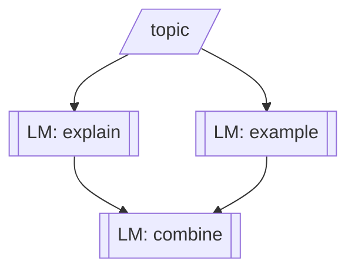
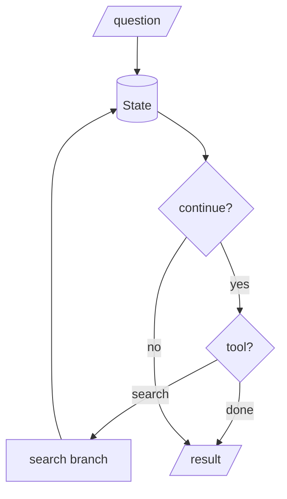

<div align="center">

# `autoform`

**Trace once. Transform freely.**

Composable function transformations for LM programs.

*JAX-like, but for LM programs: trace a Python function into an IR, then apply
program transforms around it.*

[](https://www.python.org/downloads/)
[](https://github.com/ASEM000/autoform/actions/workflows/ci.yml)
[](https://codecov.io/gh/ASEM000/autoform)

[Quickstart](#quickstart) - [Composition](#composition) - [Concurrency](#concurrency) - [Reference](#reference) - [GitHub](https://github.com/ASEM000/autoform) - [Documentation](https://autoform.readthedocs.io)

</div>

```bash
pip install git+https://github.com/ASEM000/autoform.git
```

Set provider credentials for the active LM client. For OpenAI through [LiteLLM](https://docs.litellm.ai/):

```bash
export OPENAI_API_KEY=...
```

## Quickstart

The quickstart writes one function, traces it once, then reuses the same IR in a few ways.

```python
import autoform as af


def explain(topic: str) -> str:
    prompt = af.format("Explain {} in one paragraph.", topic)
    msg = dict(role="user", content=prompt)
    return af.lm_call([msg], model="gpt-5.2")


# trace with a representative input; this records structure
ir = af.trace(explain)("placeholder topic")

# execute the same ir with real input
answer = ir.call("recursion")
print(answer)
```

Expected result: one paragraph about recursion.

Batch the same program without rewriting `explain`:

```python
# batch vectorizes the original ir over the input leaf
topics = ["recursion", "gravity", "memoization"]
answers = af.batch(ir).call(topics)

assert len(answers) == len(topics)
```

The result is one answer per topic.

Send output feedback backward to the original input:

```python
# pullback returns the output and feedback for the original inputs
pb_ir = af.pullback(ir)
answer, (topic_hint,) = pb_ir.call(("recursion",), "too abstract")

print(topic_hint)
```

Expected result: text feedback for the input topic.

Compose both:

```python
# one pullback per topic, batched by the transform
topics = ["recursion", "gravity", "memoization"]
critiques = ["too abstract", "too terse", "needs an example"]

composed = af.batch(af.pullback(ir))
answers, (topic_hints,) = composed.call((topics,), critiques)

assert len(topic_hints) == len(topics)
```

That last line is the core design: `pullback(ir)` returns an IR, and `batch`
accepts an IR.

## Why

An LM program written as ordinary Python tends to grow a second implementation
for each new execution concern: batching, feedback, concurrency, debugging, or
provider routing.

`autoform` keeps those concerns outside the function. It records the function
once as an IR, then applies transforms and execution contexts around that
recorded program. The quickstart shows the split: write normal Python, trace it
once, then decide how to transform or run it.

## Composition

The pieces do different jobs:

| Job | API | For |
| --- | --- | --- |
| Transform an IR | `batch`, `pullback`, `pushforward`, `sched`, `dce` | Build another IR from an existing IR. |
| Customize a boundary | `@af.custom` | Give a traceable Python function transform-specific rules. |
| Wrap tracing or execution | `memoize`, `lm_client`, `collect`, `inject`, `tag`, `fold` | Change behavior inside a `with` block. |
| Choose execution mode | `.call(...)`, `.acall(...)` | Run the same IR synchronously or asynchronously. |

## Concurrency

Write the function sequentially. Schedule the IR afterward.

```python
import asyncio
import autoform as af


def compare(topic: str) -> str:
    explain_prompt = af.format("Explain {} in one sentence.", topic)
    example_prompt = af.format("Give one concrete example of {}.", topic)
    explain_msg = dict(role="user", content=explain_prompt)
    example_msg = dict(role="user", content=example_prompt)

    explanation = af.lm_call([explain_msg], model="gpt-5.2")
    example = af.lm_call([example_msg], model="gpt-5.2")

    combine_prompt = af.format("Combine these:\n{}\n{}", explanation, example)
    combine_msg = dict(role="user", content=combine_prompt)
    return af.lm_call([combine_msg], model="gpt-5.2")


ir = af.trace(compare)("placeholder topic")
scheduled = af.sched(ir)
answer = asyncio.run(scheduled.acall("recursion"))
```


```mermaid
flowchart TD
    topic[/topic/] --> explain[["LM: explain"]]
    topic --> example[["LM: example"]]
    explain --> combine[["LM: combine"]]
    example --> combine
```

There is no `async def` in `compare`. Use `.call(...)` for a sync run and
`.acall(...)` for an async run.

## Debugging

`checkpoint` labels an intermediate. `collect` and `inject` wrap execution.

```python
def pipeline(topic: str) -> str:
    draft_prompt = af.format("Draft one sentence about {}.", topic)
    draft_msg = dict(role="user", content=draft_prompt)
    draft = af.lm_call([draft_msg], model="gpt-5.2")
    draft = af.checkpoint(draft, key="draft", collection="debug")

    final_prompt = af.format("Tighten this answer:\n{}", draft)
    final_msg = dict(role="user", content=final_prompt)
    return af.lm_call([final_msg], model="gpt-5.2")


ir = af.trace(pipeline)("placeholder topic")

with af.collect(collection="debug") as captured:
    result = ir.call("recursion")

with af.inject(collection="debug", values={"draft": ["Recursion calls itself."]}):
    result = ir.call("recursion")
```

The original function and IR stay the same. The context around execution changes
what happens at checkpointed values.

## Agents

Tool-use agents are just traced programs with structured outputs, `switch`
branches, and bounded `while_loop` state.


```mermaid
flowchart TD
    question[/question/] --> state[(State)]
    state --> condition{"continue?"}
    condition -- yes --> decision{"tool?"}
    decision -- search --> tool["search branch"]
    tool --> state
    decision -- done --> result[/result/]
    condition -- no --> result
```

Because the agent is one IR, the same transforms still apply:

```python
agent_ir = af.trace(agent)("question")
batched_feedback = af.batch(af.pullback(agent_ir))
```

See the [Tool-Use Agent recipe](https://autoform.readthedocs.io/en/latest/recipes/tool-use-agent.html)
for the full version.

## Reference

- [Getting Started](https://autoform.readthedocs.io/en/latest/tutorial/)
- [Concepts](https://autoform.readthedocs.io/en/latest/concepts/)
- [Recipes](https://autoform.readthedocs.io/en/latest/recipes/)
- [API Reference](https://autoform.readthedocs.io/en/latest/api/)
- [Glossary](https://autoform.readthedocs.io/en/latest/reference/glossary.html)

> Early development: API may change before a stable release.
