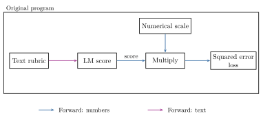
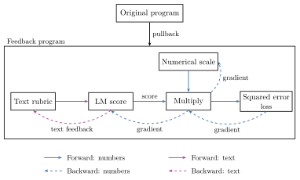
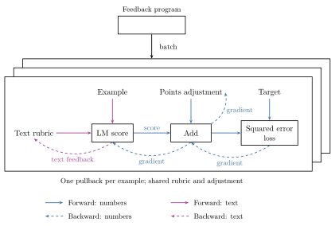

<div align="center">

# `autoform`


[](https://www.python.org/downloads/)
[](https://github.com/ASEM000/autoform/actions/workflows/ci.yml)
[](https://codecov.io/gh/ASEM000/autoform)


[Documentation](https://autoform.readthedocs.io) ·
[Getting started](https://autoform.readthedocs.io/en/latest/getting-started.html) ·
[Recipes](https://autoform.readthedocs.io/en/latest/recipes/) ·
[API reference](https://autoform.readthedocs.io/en/latest/api/)

</div>

`autoform` is an extensible framework for program transformations over user-defined types and operations.
Rules for individual operations compose to transform entire programs.
The result can be executed or transformed again.

Programs can mix text, numbers, and user-defined structures.
Extensions define how to represent changes or feedback for each type,
and how transformations handle its operations.
These building blocks support program optimization and other applications.

## Installation

`autoform` requires Python 3.12 or later.

```bash
pip install git+https://github.com/ASEM000/autoform.git
```

## A First Example

In this example, a language model grades text using a rubric, and a numerical scale adjusts the score.
A language model’s grades may differ from reference scores.
The goal is to reduce this error by adjusting the rubric and scale.
The grading program takes a text rubric and a numerical scale as inputs,
and measures the error between the scaled score and the reference score.
Program transformations produce feedback for both input types:
`pullback` creates a feedback program with text feedback for the rubric
and numerical gradients for the scale.
`batch` then applies that feedback program across examples.

<picture id="grading-program">
  <source media="(prefers-color-scheme: dark)" srcset="docs/assets/grading-program-dark.svg">
  
</picture>
<!-- end grading-program -->

```python
import autoform as af

# choose a litellm model, e.g. "openai/gpt-5.6"
model = "model-name"


# score an example and compare the scaled score with its target
def grading_loss(rubric, scale, example, target):
    # keep reference data fixed
    example, target = af.stop_gradient((example, target))
    # a slot that fill asks the lm to supply, constrained to 0 through 10
    score = af.lm.Float(min=0, max=10, desc="grading instructions")
    content = dict(rubric=rubric, example=example, score=score)
    result = af.lm.fill(content, model=model)
    error = scale * result["score"] - target
    return error * error
```

The `pullback` of the scoring program creates a feedback program. It returns both text feedback for the rubric and a numerical gradient for the scale. It calculates the loss from the example and target, which are treated as reference data.

<picture id="mixed-feedback">
  <source media="(prefers-color-scheme: dark)" srcset="docs/assets/mixed-feedback-dark.svg">
  
</picture>
<!-- end mixed-feedback -->

```python
# set the text rubric and numerical scale
rubric = "rubric instructions"
scale = 0.8

# trace the grading program with one example
sample_inputs = (rubric, scale, "example text", 8.0)
program = af.trace(grading_loss)(*sample_inputs)

# add text feedback for the rubric and gradients for the scale
feedback_program = af.pullback(program)
```

`batch` applies the feedback program to a batch of examples. The rubric, scale, and loss seed are shared data for all examples, while the example and target vary. The result contains the loss and feedback for each example.

<picture id="batched-feedback">
  <source media="(prefers-color-scheme: dark)" srcset="docs/assets/batched-feedback-dark.svg">
  
</picture>
<!-- end batched-feedback -->

```python
# choose examples and illustrative reference scores
examples = ["example text 1", "example text 2"]
targets = [8.0, 6.0]

# share rubric and scale; batch examples and targets
# the final false shares the loss seed across the batch
batch_axes = ((False, False, True, True), False)
batched_feedback = af.batch(feedback_program, in_axes=batch_axes)

# run the feedback program for all examples
batch_inputs = (rubric, scale, examples, targets)
losses, input_feedback = batched_feedback.call(batch_inputs, 1.0)

# keep rubric feedback and scale gradients
rubric_feedback, scale_gradients, _, _ = input_feedback
print(losses, rubric_feedback, scale_gradients)
```

This example composes transformations on a mixed-type program with a language
model call. Other [transforms](https://autoform.readthedocs.io/en/latest/concepts/transforms.html)
include `pushforward`, `sched`, `weight`, and `dce`.

## More

The [concepts guide](https://autoform.readthedocs.io/en/latest/concepts/index.html)
explains tracing, types, spaces, and transformation rules.

The [recipes](https://autoform.readthedocs.io/en/latest/recipes/index.html)
show batching, control flow, prompt optimization, model and tool calls, and extensions.

## Citation

Cite `autoform` in research that uses it:

```bibtex
@software{autoform,
  author       = {Asem, Mahmoud},
  title        = {AutoForm: Extensible Framework for Program Transformations over User-Defined Types},
  year         = {2026},
  url          = {https://github.com/ASEM000/autoform},
  doi          = {10.5281/zenodo.18071950},
  publisher    = {Zenodo},
  license      = {Apache-2.0}
}
```

> **Warning**
>
> Early development. Expect API changes that break existing code.
