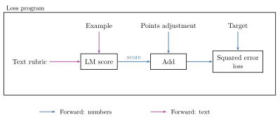

<div align="center">

# `autoform`


[](https://www.python.org/downloads/)
[](https://github.com/ASEM000/autoform/actions/workflows/ci.yml)
[](https://codecov.io/gh/ASEM000/autoform)


[Documentation](https://autoform.readthedocs.io) ·
[Getting started](https://autoform.readthedocs.io/en/latest/a-first-program.html) ·
[Recipes](https://autoform.readthedocs.io/en/latest/recipes/) ·
[API reference](https://autoform.readthedocs.io/en/latest/api/)

</div>

`autoform` is an extensible framework for program transformations over user-defined types and operations.
Rules for individual operations compose to transform entire programs.
The result can be executed or transformed again.

Programs can mix text, numbers, and user-defined structures.
Extensions define how to represent changes or feedback for each type,
and how transformations handle its operations.
These building blocks support program optimization and other applications.

## Installation

`autoform` requires Python 3.12 or later.

```bash
pip install git+https://github.com/ASEM000/autoform.git
```

## A First Example

In this first example, a language model grades text based on a rubric. A points adjustment then raises or lowers the grade: an adjustment of 1 adds one point to every grade. The program has two parameters, the text rubric and the numerical adjustment.

<picture id="grading-program">
  <source media="(prefers-color-scheme: dark)" srcset="docs/assets/grading-program-dark.svg">
  
</picture>
<!-- end grading-program -->

```python
import autoform as af


def forward(rubric, adjustment, x):
    # a slot that fill asks the lm to supply, constrained to 0 through 10
    score = af.lm.Float(min=0, max=10, desc="grading instructions")
    content = dict(rubric=rubric, example=x, score=score)
    # choose a litellm model, e.g. "openai/gpt-5.6"
    result = af.lm.fill(content, model="model-name")
    return result["score"] + adjustment
```

The predicted grade may not match the reference grade, so the loss program calculates the squared error between the two. The goal is to reduce this loss by updating the rubric and points adjustment while keeping the example and reference fixed.

<picture id="grading-loss">
  <source media="(prefers-color-scheme: dark)" srcset="docs/assets/grading-loss-dark.svg">
  
</picture>
<!-- end grading-loss -->

```python
def loss_func(rubric, adjustment, x, y):
    x, y = af.stop_gradient((x, y))
    error = forward(rubric, adjustment, x) - y
    return error * error
```

Applying `pullback` to the loss program creates a feedback program for the rubric and points adjustment. Rubric feedback is text, and the adjustment gradient is a number. Both are computed using the same loss function and the rules for language model calls and numerical operations.

<picture id="mixed-feedback">
  <source media="(prefers-color-scheme: dark)" srcset="docs/assets/mixed-feedback-dark.svg">
  
</picture>
<!-- end mixed-feedback -->

```python
# set the text and numerical parameters
rubric = "rubric instructions"
adjustment = 0.0

# trace the grading program with one example
sample_inputs = (rubric, adjustment, "example text", 8.0)
program = af.trace(loss_func)(*sample_inputs)

# add text feedback for the rubric and gradients for the adjustment
feedback_program = af.pullback(program)
```

Finally, `batch` applies the feedback program to a batch of examples, holding the rubric, points adjustment, and loss seed constant, and returning the loss and feedback for each example.

<picture id="batched-feedback">
  <source media="(prefers-color-scheme: dark)" srcset="docs/assets/batched-feedback-dark.svg">
  
</picture>
<!-- end batched-feedback -->

```python
# choose examples and illustrative reference scores
examples = ["example text 1", "example text 2"]
targets = [8.0, 6.0]

# `False` axis means share the parameter, while True means batch it over
# programs. the tuple axesshape matches the shape of the arguments input
batch_axes = ((False, False, True, True), False)
batched_feedback = af.batch(feedback_program, in_axes=batch_axes)

# run the feedback program for all examples
batch_inputs = (rubric, adjustment, examples, targets)
losses, feedback = batched_feedback.call(batch_inputs, 1.0)

# keep rubric feedback and adjustment gradients
rubric_feedback, adjustment_grad, _, _ = feedback
print(losses, rubric_feedback, adjustment_grad)
```

This example composes transformations on a mixed-type program with a language
model call. The [transforms guide](https://autoform.readthedocs.io/en/latest/concepts/transforms.html)
also covers:

- `pushforward`: propagates input changes forward.
- `sched`: groups independent operations for parallel execution.
- `weight`: multiplies weights along the execution path.
- `dce`: removes computations unused by the selected outputs.

## More

The [concepts guide](https://autoform.readthedocs.io/en/latest/concepts/index.html)
explains tracing, types, spaces, and transformation rules.

The [recipes](https://autoform.readthedocs.io/en/latest/recipes/index.html)
cover tool use, tool ranking, human review, and array extensions.

## Citation

Cite `autoform` in research that uses it:

```bibtex
@software{autoform,
  author       = {Asem, Mahmoud},
  title        = {AutoForm: Extensible Framework for Program Transformations over User-Defined Types},
  year         = {2026},
  url          = {https://github.com/ASEM000/autoform},
  doi          = {10.5281/zenodo.18071950},
  publisher    = {Zenodo},
  license      = {Apache-2.0}
}
```

> **Warning**
>
> Early development. Expect API changes that break existing code.
